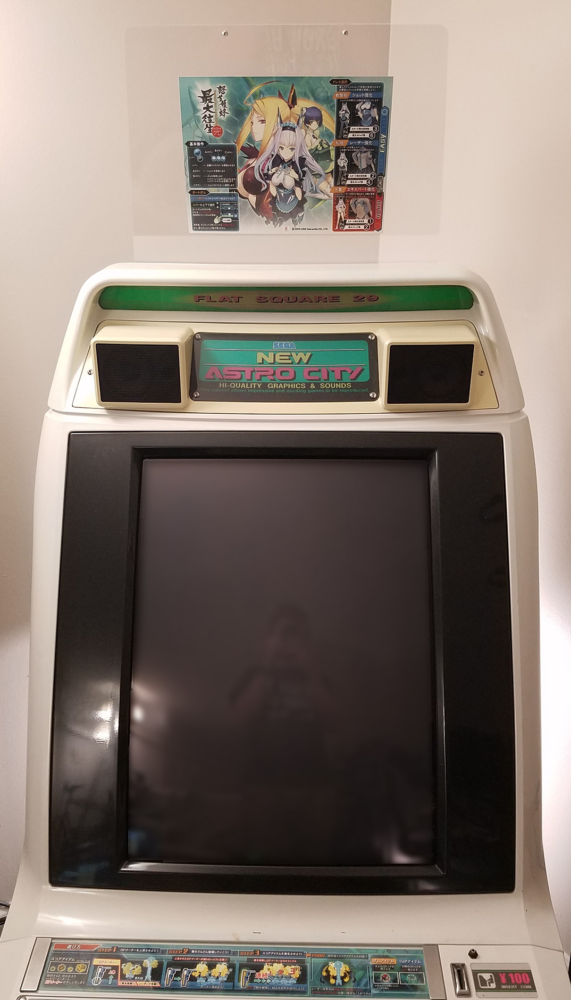

# (New) Astro City Marquee Holder
V1  
Design by Tobias Heinemann / Softdrink 117 c. 2022  
[Licensed under CC-BY](./LICENSE)

-----

This repository contains basic designs for DIY laser-cut marquee holders compatible with the SEGA Astro City and New Astro City arcade cabinets.

## Versions

### [Version 1](./V1/)
This was created using reference images scrounged from the internet, and rough dimensions provided by a couple friends. It has a number of dimensional inaccuracies when compared with the original design, and uses a simpler construction that is more achievable for a DIY project (layered acrylic compared to the molded plastic of the original).

Despite the inaccuracies, this design has a couple useful advantages compared to the original. In particular, being able to fit larger artwork has been a feature I've enjoyed a lot.

### Version 2
WIP...

### Comparison Table

|  | Original SEGA | [Softdrink V1](./V1/) |
| ------: | :-------------: | :--: |
| **Max. marquee size** | ISO B4* | ISO A3 |
| **Construction** | Cast plastic | Laser-cut acrylic |
| **UV properties** | Unknown | Controllable** |
| **Dimensions** | 469 x 345mm | 472 x 346mm |
| **Tapered Width** | 433mm | 432mm |
| **Bottom Corner Radii** | Approx. 10mm | 10mm |
| **Top Corner Radii** | Approx. 15mm | 10mm |
| **Cabinet clearance** | 5mm | Approx. 3mm |

> *Technically, the largest supported size with the original holder design is approx. 360mm x 270mm. This is larger than ISO A4 or ISO B4, but not as large as JP B4 or ISO B3.

> **Using different types of acrylic with known properties, it would be possible to make UV-safe marquee holders, to better protect original game artwork.

## Bill of Materials

### Acrylic

The [V1](./V1/) design is intended to be made from two sheets of 1/8" (3.0mm) transparent clear acrylic. There are many sources for acrylic; one example would be [MakerStock](https://makerstock.com/collections/acrylic/products/clear-acrylic?variant=32575693652065).

> The V1 design is currently laid out for 32x18" sheets, due to local supply. I would *strongly recommend* adjusting the layout to more optimally fit your intended material size. As an example, the entire V1 design can be fit into a single 32x24" sheet, instead of two 32x18" sheets. 20x16" is approximately the minimum viable size to cut each panel of the V1 design.

> I haven't tested specifically, but I suspect that 3/16" (4.5mm), 1/10" (2.5mm), or even 5/64" (2.0mm) would also work fine. I would not recommend going thicker than 3/16", however, due to the density and weight of thicker acrylic sheets - they might not be very stable when secured with only two screws.

### Hardware

Whichever version of the Marquee Holder you choose to build, you will need some hardware to install it. Example purchase links (for bulk builds) are indicated below - though there are many, many places to obtain equivalent parts.

| Part | Quantity | Hex Head | Tamper-Resistant Head |
| ---- | :------: | :------- | :-------------------- |
| M4 Cap Nut | 2x | [McMaster-Carr (25/pkg)](https://www.mcmaster.com/94000A035/) | N/A |
| M4x16mm Screw | 2x | [McMaster-Carr (100/pkg)](https://www.mcmaster.com/92095A194/) | [McMaster-Carr (25/pkg)](https://www.mcmaster.com/95635A675/) |
| M4x8mm Screw | 2x | [McMaster-Carr (100/pkg)](https://www.mcmaster.com/92095A189/) | [McMaster-Carr (25/pkg)](https://www.mcmaster.com/95635A671/) |

> NOTE: I would *strongly* recommend against ordering hardware online unless you're building a large quantity of holders, as you'll likely pay much less locally, and online sellers usually sell fasteners in large minimum quantities. You should be able to find the necessary parts at a decent local hardware store (though you may need to visit a "real" hardware store - big-box stores rarely have a good enough selection of specialty fasteners such as these, at least in the US).

The official recommendation is to use tamper-resistant screws, but for home-use convenience, I would recommend switching to regular hex head screws.

## Installation

Please see the following diagram ([found on the Arcade Otaku wiki; ](https://wiki.arcadeotaku.com/images/b/b6/Astro_marquee_holder_fittings.JPG)[a copy is also hosted here for convenience](./external_resources/From_ArcadeOtaku_Wiki__Astro_marquee_holder_fittings.jpg)) for installation details:

