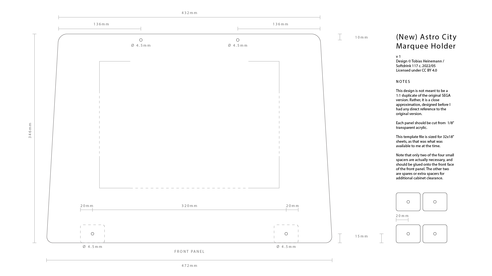
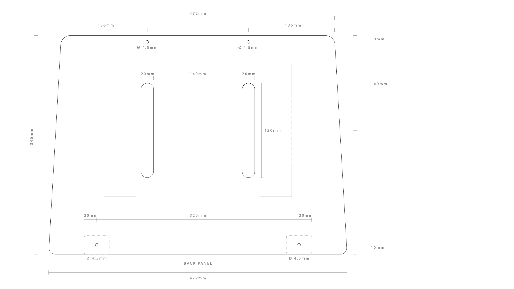
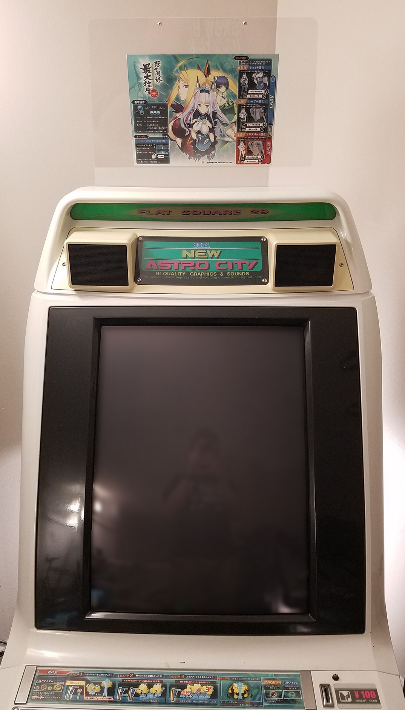
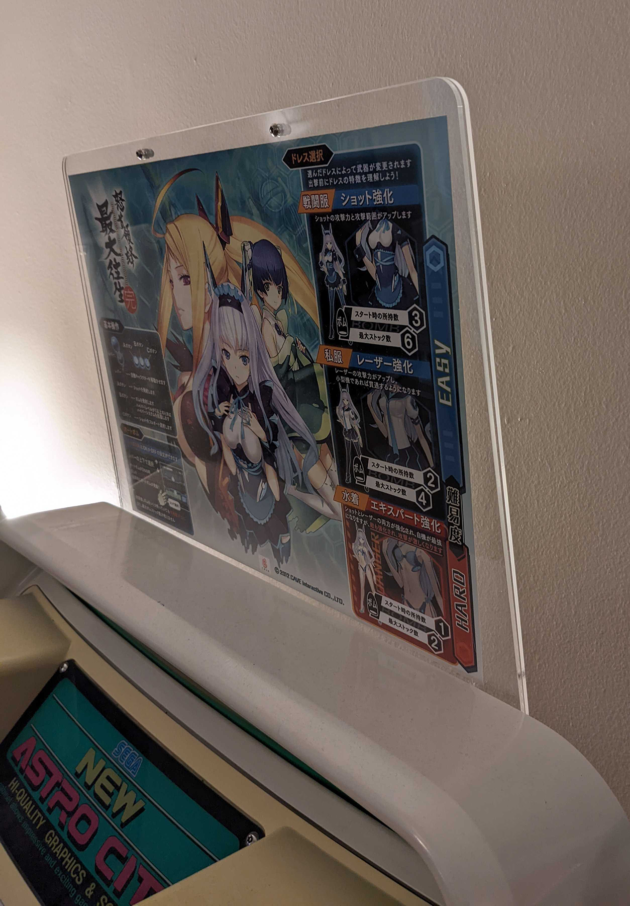
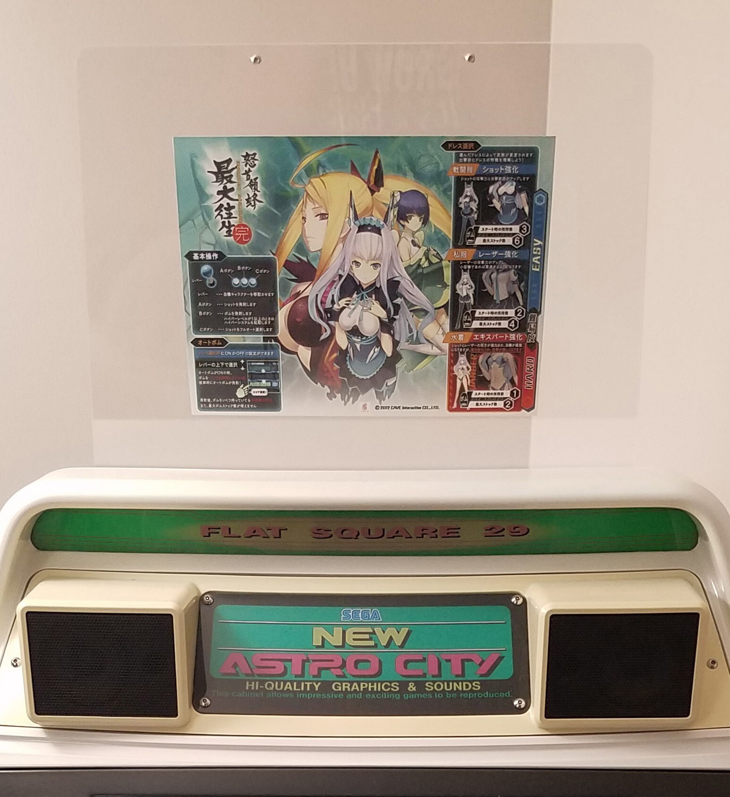
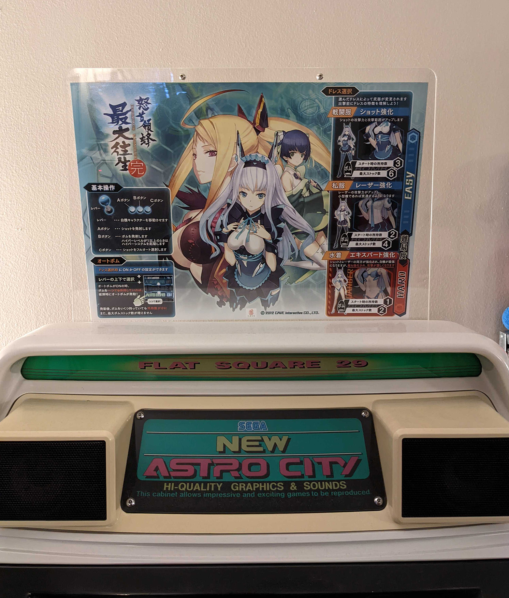
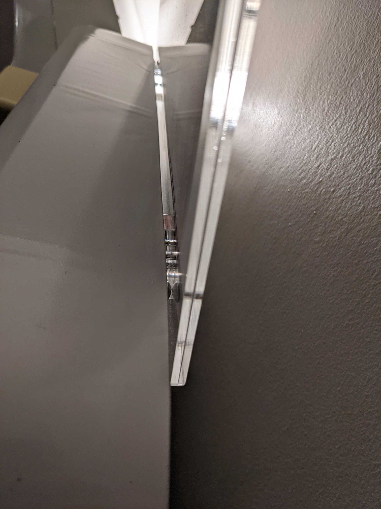
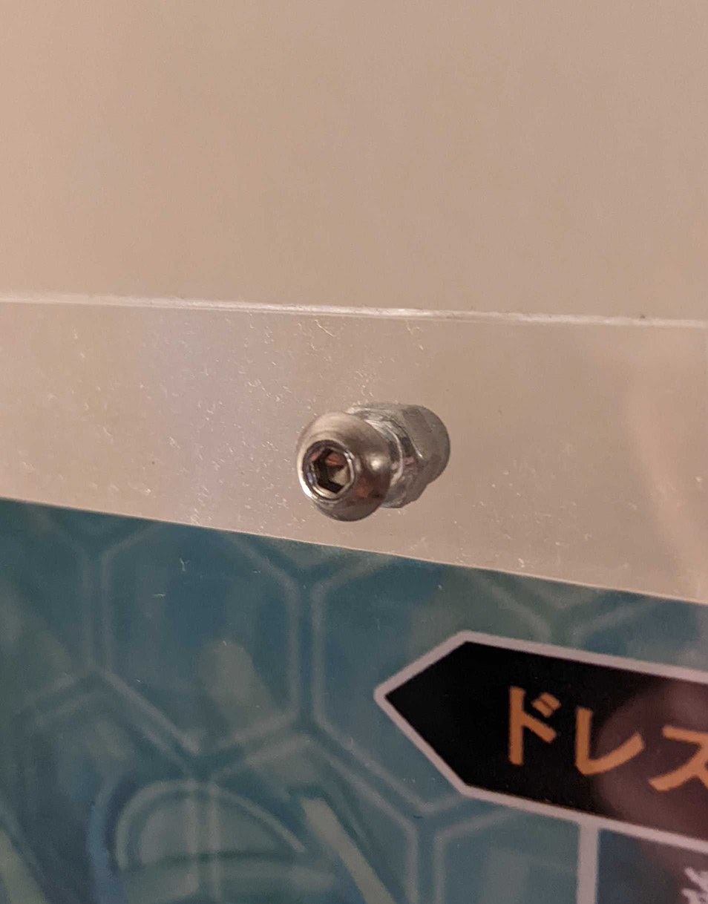

## Astro City Marquee Holder - Version 1
V1  
Design by Tobias Heinemann / Softdrink 117 c. 2022  
[Licensed under CC-BY](../LICENSE)

This is version 1 of a design for reproduction marquee holders designed to fit the Astro City and New Astro City arcade cabinets.

As noted in the [main readme](../README.md), these cutfiles are currently sized for 32x18 inch acrylic of 1/8" (nominal) thickness. This was a common size available to me when I made the design, but it is not the most efficient layout for all sheet sizes. If you use a different sheet size, you may want to change the layout of the parts to better match your material.

This directory features a dimensional drawing of the design (in the form of [Adobe Illustrator](./dimensional_drawing/Astro%20City%20Marquee%20Holder%20V1%20Repro%20Dimensions.ai), [PDF](./dimensional_drawing/Astro%20City%20Marquee%20Holder%20V1%20Repro%20Dimensions.pdf), and PNGs of the [Front](./dimensional_drawing/Front_Panel.png) and [Back](./dimensional_drawing/Back_Panel.png) panels), ready-to-cut files of the design (in [Illustrator 8](./cutfile/Astro_City_Marquee_Holder_V1_Repro_CUTFILE.ai) and [PDF](./cutfile/Astro_City_Marquee_Holder_V1_Repro_CUTFILE.pdf) formats - backsaved for legacy compatibility), and a few photos of the marquee holder as-installed.

### Installed Photos

### Art Sizes

*The Version 1 marquee holder with an A4 instruction card fitted.*

*The Version 1 marquee holder with an A3 instruction card fitted.*

As mentioned in the comparison table in the [main readme](../README.md), my Version 1 marquee holder design can fit larger artwork than the original SEGA version. The original holder can fit up to approximately ISO B4 or A4, whereas this variation can fit ISO A3 without significantly changing the exterior dimensions of the holder or the cabinet fitment.

I don't know if any games have instruction cards that are sized this large by default, but when using reprinted or custom artwork, it can create a pleasing effect. Both A4 and A3 sizes of *Dodonpachi Saidaioujou* themed artwork shown here are reprints I made myself, not originals.

### Mounting

*Closeup of the connection between the marquee holder and the cabinet.*

*Closeup of the screws and cap nuts used to hold the top edge of the marquee holder together.*

As noted in the [main readme](../README.md), the marquee holder is attached to the cabinet with two M4x16mm screws. It also uses a set of M4x8mm screws with matching M4 cap nuts to close the two panels together along the top edge, and "sandwich" the artwork between them.
